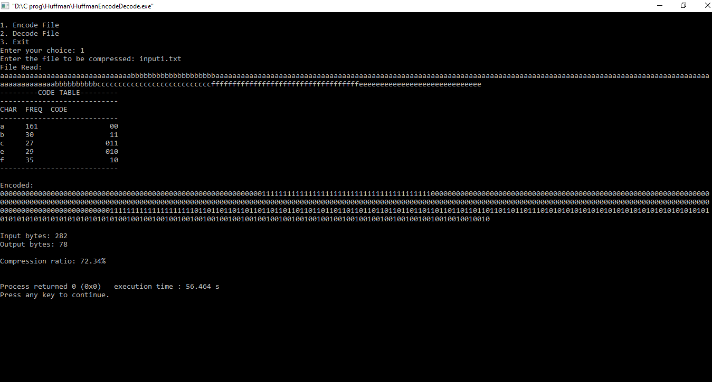

 # Huffman_Encode_Decode

Huffman compression is a lossless data compression algorithm that reduces the size of files by encoding characters with variable-length codes, where frequently occurring characters are represented with shorter codes and less frequent characters with longer codes. This algorithm is widely used in various file compression formats, such as ZIP and JPEG.

## Table of Contents

1. [Project Overview](#project-overview)
2. [Data Structures](#data-structures)
3. [Functions](#functions)
4. [Usage](#usage)
5. [File Formats](#file-formats)
6. [Installation](#installation)
7. [Examples](#examples)
8. [Contributing](#contributing)
9. [License](#license)

## Project Overview

The Huffman Compression Algorithm implemented in this project comprises two main components: encoding and decoding.

### Encoding

This component takes an input file and generates a compressed output file using Huffman encoding. It builds a Huffman tree based on the character frequencies in the input file and assigns variable-length codes to each character. The compressed data is written to an output file, along with a header that contains information about the compressed data.

### Decoding

This component takes a compressed Huffman-encoded file and decompresses it, recovering the original data. It uses the Huffman tree stored in a separate `.table` file to decode the compressed data and writes the decompressed data to an output file.

## Data Structures

The project uses the following data structures:

- **Node Structure (`struct Node`):** Represents a node in the Huffman tree. Each node contains pointers to its left and right children (if any), a character (for leaf nodes), and a frequency count.

- **Global Variables:**
  - `nodeCount:` Counts the number of nodes in the Huffman tree.
  - `queueEnd:` Tracks the end of the priority queue used during tree construction.
  - `pool[256]:` An array of nodes used for memory allocation.
  - `queue[255]:` A priority queue for nodes.
  - `codes[128]:` An array to store Huffman codes for each character.
  - `buffer[1024]:` A buffer for code generation.

## Functions

The project includes several functions to perform encoding, decoding, and other related tasks:

- `createNode:` Creates a new node with the given frequency, character, and child nodes if applicable.

- `insertIntoQueue:` Inserts a node into the priority queue based on its frequency.

- `removeFromQueue:` Removes the node with the lowest frequency from the priority queue.

- `generateCode:` Generates and assigns Huffman codes for each character in the tree.

- `importData:` Reads data from an input file, calculates character frequencies, and builds the Huffman tree.

- `importTable:` Reads frequency data from a table file to build the Huffman tree for decoding.

- `printCodeTable:` Prints the character frequencies and corresponding Huffman codes in a tabular format.

- `encodeFile:` Encodes data from an input file using the Huffman codes and saves it to an output file.

- `decodeFile:` Decodes data from a Huffman-encoded file and saves the decoded data to an output file.

- `huffmanEncode:` Handles the encoding process by taking user input for the file to be compressed and performing the compression.

- `huffmanDecode:` Handles the decoding process by taking user input for the file to be decompressed and performing the decompression.

## Usage

To use this Huffman Compression program, follow these steps:

1. Compile the C code provided using a C compiler, e.g., `gcc`.

```bash
gcc huffman.c -o huffman
Execute the compiled program.
./huffman
Choose one of the following options:

Encode File: Compress a file using Huffman encoding.
Decode File: Decompress a Huffman-encoded file.
Exit: Terminate the program.
Follow the on-screen prompts to perform the selected operation.
```
## File Formats
This project uses the following file formats:

- `Input File:` The file to be compressed or decompressed.

- `Output File:` The compressed or decompressed data is written to this file.

- `Frequency Table File (.table):` Stores character frequencies for use during decoding.

- `Compressed File (.huffman):` Stores the Huffman-encoded data along with a header containing information about the compressed data.

- `Note:` The frequency table file and the compressed file should have the same base name, e.g., example.huffman and example.table.

## Installation
Include any installation instructions or dependencies that need to be installed for your project.


## Examples

### Snapshot 1


### Snapshot 2


### Snapshot 3


### Snapshot 4


### Snapshot 5


## Contributing
If you'd like to contribute to this project, please read our contributing guidelines for more information.

## License
This project is licensed under the MIT License.
